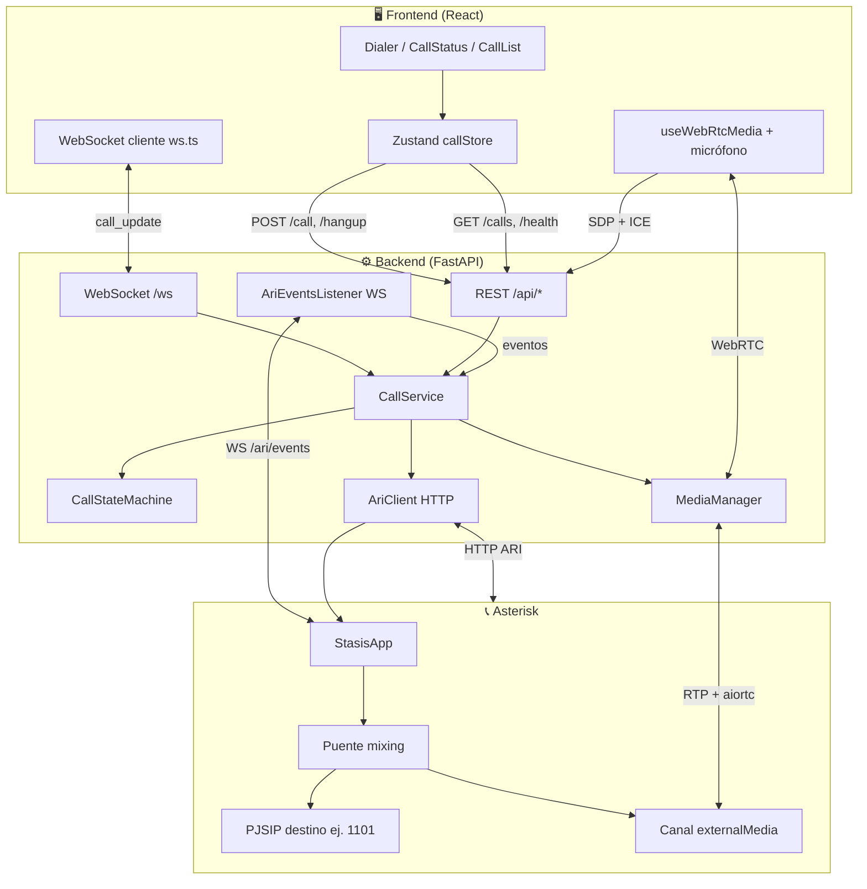
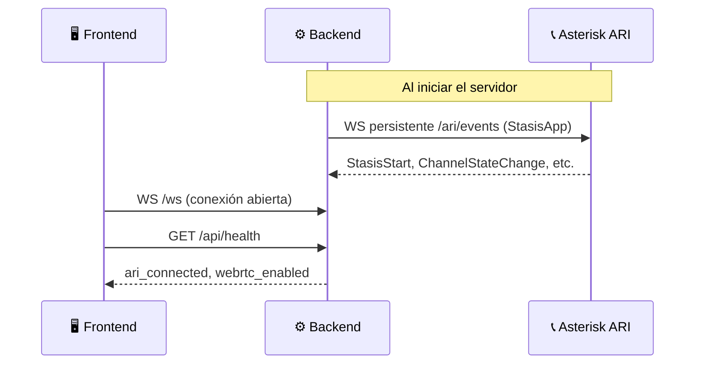
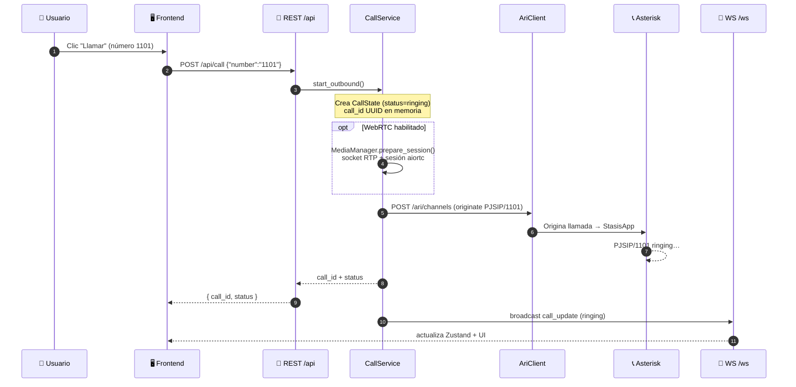
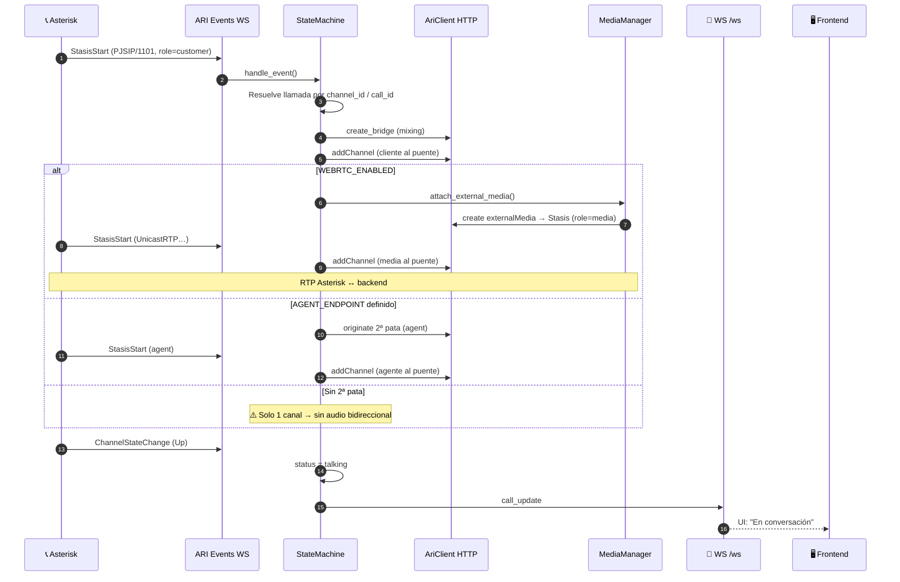
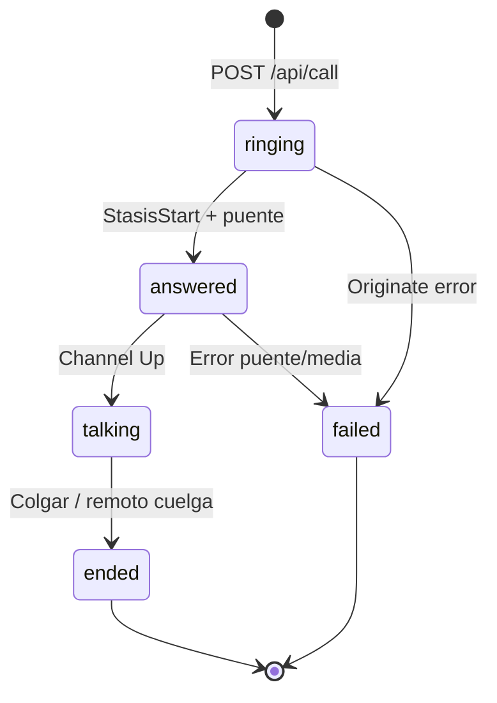
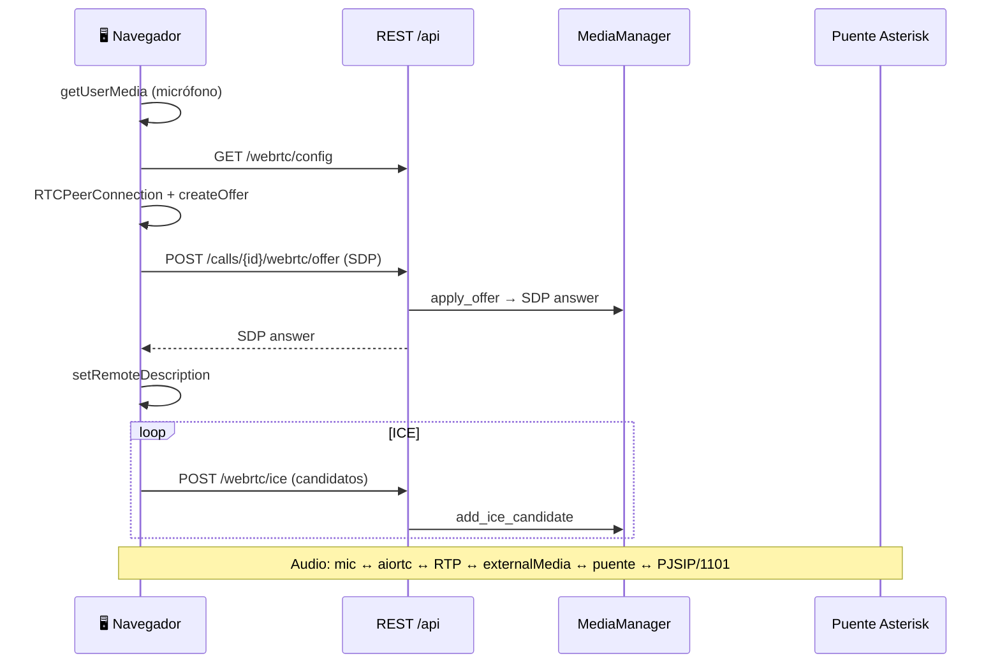
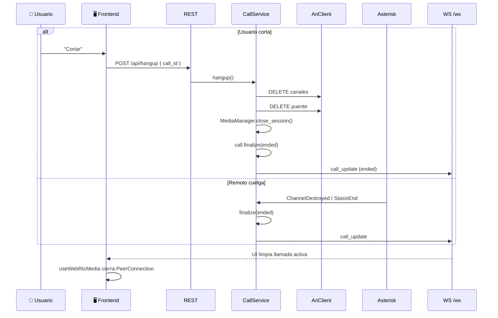
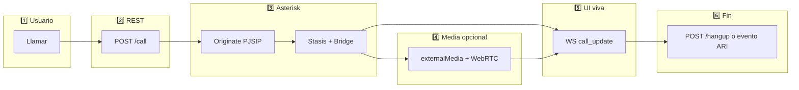

# Roadmap: flujo de una llamada (inicio → fin)

Vista general de **quién habla con quién**. El frontend **nunca** toca ARI directamente.

## Arquitectura general

---

## Fase 0 — Arranque (siempre activo)

| Paso | Qué pasa |
|------|----------|
| 1 | Al levantar el backend, `CallService.startup()` limpia canales viejos y **abre el WebSocket a ARI** (`AriEventsListener` → `ws://asterisk/ari/events?app=StasisApp`). |
| 2 | El frontend en `Home` ejecuta `useCallSocket()`: conecta a **`/ws`**, hace `GET /api/calls` y `GET /api/health` cada 15 s. |
| 3 | El panel muestra si ARI está conectado (`ari_connected` + `ari_reachable`). |

---

## Fase 1 — Iniciar llamada saliente

**Acción del usuario:** botón **Llamar** en el Dialer.

**Detalle backend (`CallService.start_outbound`):**

1. Registra la llamada en `CallRegistry` (`ringing`).
2. Si `WEBRTC_ENABLED=true`, prepara RTP/WebRTC **antes** de que conteste el destino.
3. `originate_channel` → endpoint `PJSIP/1101`, `app=StasisApp`, `appArgs=call_id,customer`.
4. Guarda el `channel_id` de Asterisk y notifica al frontend.

---

## Fase 2 — Asterisk contesta → Stasis + puente + audio

Cuando el **destino contesta**, el canal entra en Stasis. El backend **no espera al frontend** para esto: lo maneja el **WebSocket ARI**.

**Estados típicos de la llamada:**

---

## Fase 3 — WebRTC (voz en el navegador)

Solo si `WEBRTC_ENABLED=true`. Corre **en paralelo** cuando hay una llamada activa (`useWebRtcMedia`).

El frontend **no** usa WebSocket para el audio; solo REST para SDP/ICE. El WebSocket del frontend es solo para **estado** de la llamada.

---

## Fase 4 — Actualizaciones en tiempo real (UI)

| Origen | Mensaje | Frontend |
|--------|---------|----------|
| Cualquier cambio en `CallService` | `{ type: "call_update", call: {...} }` vía `ConnectionManager.broadcast` | `useCallSocket` → `upsertCall` → CallStatus / CallList |
| Usuario no hace nada | Asterisk envía eventos por ARI WS | Misma ruta |

**Dos WebSockets distintos:**

| WebSocket | Entre | Para qué |
|-----------|--------|----------|
| **ARI** (`/ari/events`) | Backend ↔ Asterisk | Eventos de canales, Stasis, estados |
| **App** (`/ws`) | Frontend ↔ Backend | Estado de llamadas para la UI |

---

## Fase 5 — Finalizar llamada

**Acción:** botón **Cortar** o el remoto cuelga.

---

## Mapa rápido por capa

---

## Archivos clave (para seguir el código)

| Capa | Archivo | Rol |
|------|---------|-----|
| UI | `frontend/src/components/Dialer.tsx` | Botones Llamar/Cortar |
| Estado FE | `frontend/src/store/callStore.ts` | `postCall`, `postHangup` |
| WS FE | `frontend/src/hooks/useCallSocket.ts` | Escucha `call_update` |
| Audio FE | `frontend/src/hooks/useWebRtcMedia.ts` | Mic + SDP/ICE |
| API | `backend/api/routes.py` | Endpoints REST |
| Orquestación | `backend/services/call_service.py` | Originate, hangup, notify |
| Lógica llamada | `backend/calls/state_machine.py` | Stasis, puente, media |
| Eventos ARI | `backend/ari/events.py` | WS hacia Asterisk |
| HTTP ARI | `backend/ari/client.py` | originate, bridge, hangup |
| Media | `backend/media/manager.py` | RTP + externalMedia + WebRTC |
| WS app | `backend/websocket/manager.py` | Broadcast al frontend |

---

## Resumen

**Frontend** pide la llamada por **REST** y se entera del progreso por **WebSocket `/ws`**; **backend** controla Asterisk por **HTTP ARI** y escucha eventos por **WebSocket ARI**; cuando el destino contesta, **Stasis** mete el canal en un **puente** y, si está activo, **externalMedia + WebRTC** conectan el navegador al audio; al colgar, se liberan canales, puente y sesión media.
